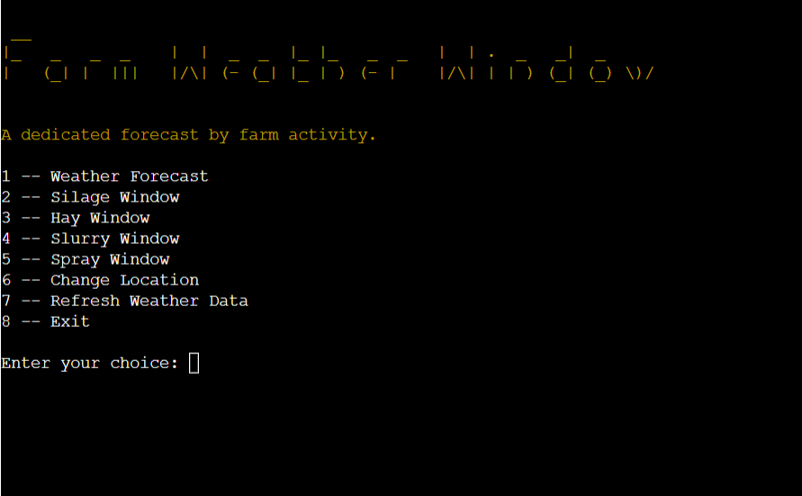
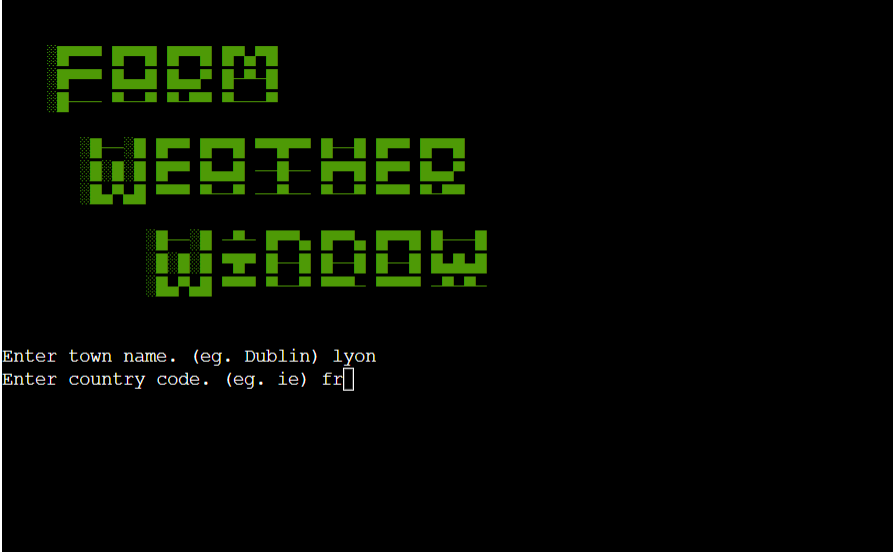
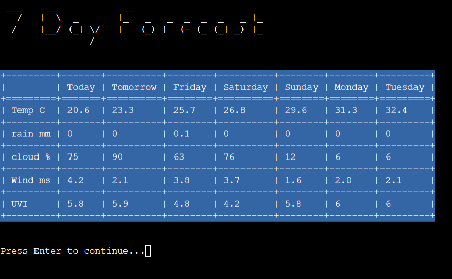
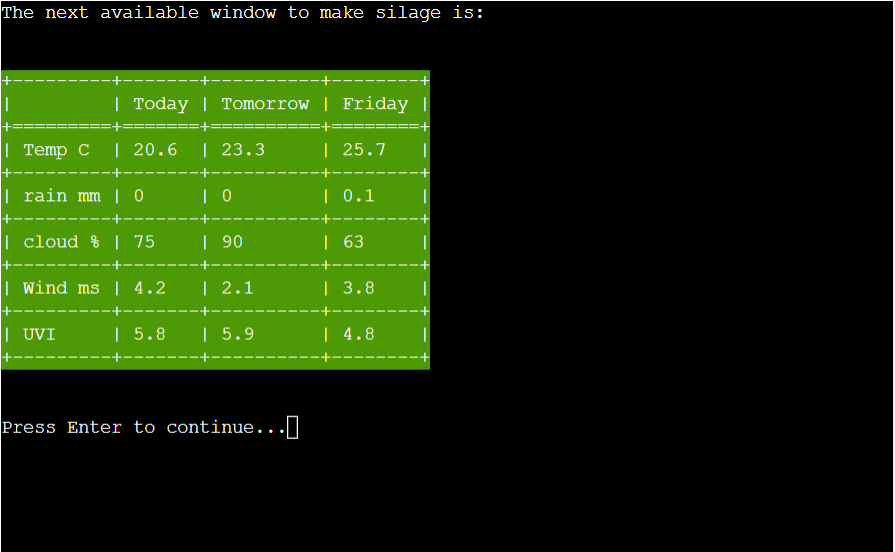
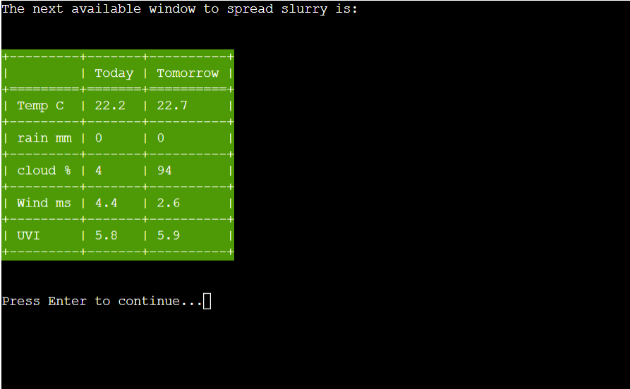
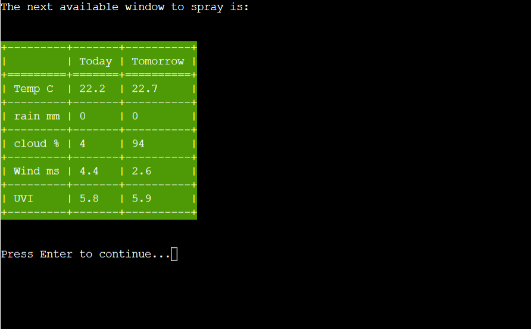

# Farm Weather Window
Farm Weather Window is a forecast tool to predict windows in the coming week to perform specific farm tasks. Many farm tasks have specific weather requirements including wind, precipitation levels and cloud cover.

Live Site: [Farm Weather Window](https://farm-weather-window-7024a2604c2c.herokuapp.com/)



## Features

### Title and Set Location Screen

On first loading of the program the user is prompted for a town name and country code.
This uses the Open Weather Map Geolocation API to determine latitude and longitude for the main Forecast API.
This screen can be re-called at any time from the main menu. 



### Options menu

Once a location has been established the main menu loads, where the user can select the desired forecast.
They may also choose to refresh the weather data, change location or end the program.


###  Weather Forecast

The Weather Forecast option loads a standard 7 day forecast.
The weather data is pulled from the Open Weather Map One Call API.



### Silage Window

Silage making requires 3 days with low rainfall amounts.
If available the Silage Window option will show the next weather window to make silage.
Otherwise, will state that there is no window available in the coming week.



### Hay Window

Hay making requires 5 days with close to 0 rainfall and ideally should have bright days. 
If available the Hay Window option will show the next weather window to make hay.
An additional warning that extra theading may be required is displayed if the days will be very overcast.
Otherwise, will state that there is no window available in the coming week.


### Slurry Window

Slurry Spreading requires low rainfall on day of spreading and a forecast for the following day without heavy rain.
If available the Slurry Window option will show the next weather window to spread slurry.
Otherwise, will state that there is no window available in the coming week.



### Spray Window

Spraying requires low rainfall and very little wind, there should also be low rainfall on the following day.
If available the Spray Window option will show the next weather window for spraying crops.
Otherwise, will state that there is no window available in the coming week.



### Future Features

This program works as a proof of concept but I have deliberately left out some features to simplify the demonstration.

- Seasons, you can't make hay in winter in Ireland, but additional variables like seasons or hours of day light would make demonstration of the app imposible outside of the summer months.
- Multiple overlapping windows per week are possible and are currently stored in a list but I've chosen not to display due to the limited space on an 80 X 24 character terminal but would make more sense if this project were converted to a backend for a web app.

Some additional future features should also include.

- Farm specific weather warnings like blight and grass tetany.  
- Additional farming tasks.


## Data Model

The weather forecast data is received as json formatted data from the Open Weather Map API. <br>
Farm Weather Window uses the Forecast class to extract the necessary weather data.

Functions that call the Forecast class are used to build lists containing 7 days of data for each weather type.

Then functions for each farm activity iterate through the lists and build the weather forecast tables based on their individual condition statements.


## Testing

### PEP8 Testing

Ran code through [CI Python Linter](https://pep8ci.herokuapp.com/) with no issues.

### Input Testing
All user inputs were tested thoroughly to ensure all input data is handled correctly and appropriate feedback is given to the user as follows:

:white_check_mark: Set location blank entries - Returns 'Town or country cannot be blank'  <br>
:white_check_mark: Set location invalid location or country code - Returns 'Location Not found, Please try again' <br>
:white_check_mark: Main menu enter non numeric characters - Returns 'Invalid Input', 'Please enter a number between 1 and 8' <br>
:white_check_mark: Main menu enter number not between 1 and 8 - Returns 'Please enter a number between 1 and 8' <br>
:white_check_mark: Check Each menu option 1 to 8 - All behave as expected.  <br>

### API Testing
:white_check_mark: Test API unreachable - Returns 'Connection Error: please try again later.' <br>
:white_check_mark: Test Invalid API key - Returns 'Invalid API key. Please see https://openweathermap.org/faq#error401 for more info.' <br>

### Functionality testing
:white_check_mark: Tested each forecast window using different regions in order to produce an available window.<br>
:white_check_mark: Tested each forecast window using different regions in order to produce no window available message.   <br>

## Bugs

### Fixed Bugs

- Overcast warning: - Equation missing parentheses.
- Hay date range: - Range to large for 7 day forecast causing program to crash.

### Unfixed Bugs

- No known unfixed bugs.

## Libraries and Technologies Used

### Python Libraries:
- [Requests](https://pypi.org/project/requests/) - Used for API requests. <br>
- [Os](https://docs.python.org/3/library/os.html) - Used for OS interactions. <br>
- [Json](https://docs.python.org/3/library/json.html) - Used to handle json formatted data from the API. <br>
- [Time](https://docs.python.org/3/library/time.html) - Used to convert timestamps to days. <br>
- [Colorama](https://pypi.org/project/colorama/) - Used to add color. <br>
- [Texttable](https://pypi.org/project/texttable/) - Used to build tables for weather forecasts. <br>
- [Art](https://pypi.org/project/art/) - Used to create large fonts. <br>

### Tools Used
- [GitHub](https://github.com/Farmer-Eds-Shed/Farm-Weather-Window) - Code Repo
- [Code Anywhere](https://app.codeanywhere.com/) - IDE
- [Heroku](https://heroku.com/) - Deployment
- [Node-Red](https://nodered.org/) - Experimentation with API requests.


## Deployment

- The site was deployed via [Heroku](https://dashboard.heroku.com/apps) using Code Institutes mock terminal, and the live link can be found [here:](https://farm-weather-window-7024a2604c2c.herokuapp.com/) 

- Before deploying to Heroku pip3 freeze > requirements.txt was used to add all the dependencies required to the requirements.txt file.

- Steps for deployment:
    - Fork or clone this repository
    - Create a new Heroku app
    - Set the buildbacks to ```Python``` and ```NodeJS``` in that order
    - Add config var Port = 8000
    - Add config var OWM_API_KEY = 'Your API Key'
    - Link the Heroku app to the repository
    - Click on **Deploy**


## Credits 
- [codingninjas.com](https://www.codingninjas.com/studio/library/how-to-clear-a-screen-in-python) - Clear screen function
- [computinglearner.com](https://computinglearner.com/how-to-create-a-menu-for-a-python-console-application/?utm_content=cmp-true) - Main menu
- [Code Institute](https://github.com/Code-Institute-Org/python-essentials-template) - Python Essentials Template
