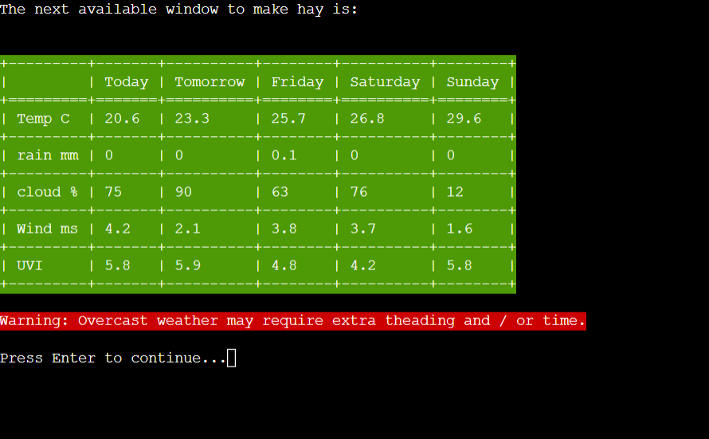

# Farm Weather Window
Farm Weather Window is a forecast tool to predict windows in the coming week to perform specific farm tasks. Many farm tasks have specific weather requirements including wind, percipitation levels and cloudcover.

Live Site: [Farm Weather Window](https://farm-weather-window-7024a2604c2c.herokuapp.com/)

## Features

### Title and Set Location Screen

On first loading of the program the user is prompted for a town name and country code.
This uses the Open Weather Map Geolocation API to determin latitude and longitude for the main Forecast API.
This screen can be re-called at any time from the main menu. 

### Options menu

Once a location has been established the main menu loads, where the user can select the desired forecast.
They may also choose to refresh the weather data, change location or end the program.

###  Weather Forecast

The Weather Forecast option loads a standard 7 day forecast.
The weather data is pulled from the Open Weather Map One Call API.

### Silage Window

Silage making requires 3 days with low rainfall amounts.
If available the Silage Window option will show the next weather window to make silage.
Otherwise will state that there is no window available in the comming week.

### Hay Window

Hay making requires 5 days with close to 0 rainfall and idealy should have bright days. 
If available the Hay Window option will show the next weather window to make hay.
An aditional warning that extra theading may be required is displayed if the days will be very overcast.
Otherwise will state that there is no window available in the comming week.

### Slurry Window

Slurry Spreading requires low rainfall on day of spreading and a forecast for the following day without heavy rain.
If available the Slurry Window option will show the next weather window to spread slurry.
Otherwise will state that there is no window available in the comming week.

### Spray Window

Spraying requires low rainfall and very little wind, there should also be low rainfall on the following day.
If available the Spray Window option will show the next weather window for spraying crops.
Otherwise will state that there is no window available in the comming week.

### Future Features

This program works as a proof of concept but I have delibretly left out some features to simplify the demonstration.

- Seasons, you can't make hay in winter in Ireland, but additional variables like seasons or hours of day light would make demonstration of the app imposible outside of the summer months.
- Multiple overlapping windows per week are possible and are currently stored in a list but I've choosen not to display due to the limited space on an 80 X 24 charecter terminal but would make more sense if this project were converted to a backend for a web app.

Some additional future features should also include.

- Farm specific weather warnings like blight and grass tetany.  
- Additional farming tasks.

## Data Model

The weather forecast data is recieved as json formatted data from the Open Weather Map API.
Farm Weather Window uses the Forecast class to extract the nessacery weather data.

Functions that call the Forecast class are used to build lists containing 7 days of data for each weather type.

Then functions for each farm activity iterate through the lists and build the weather forecast tables based on their individual condition statements.

## Testing

### PEP8 Testing

Ran code through [CI Python Linter](https://pep8ci.herokuapp.com/) with no issues.

### Input Testing
All user inputs were tested thoroughly to ensure all input data is handled correctly and appropriate feedback is given to the user as follows:

Set location blank entries - Returns 'Town or country cannot be blank'
Set location invalid location or country code - Returns 'Loction Not found, Please try again'
Main menu enter non numeric charecters - Returns 'Invalid Input', 'Please enter a number between 1 and 8'
Main menu enter number not between 1 and 8 - Returns 'Please enter a number between 1 and 8'
Check Each menu option 1 to 8 - All behave as expected.

### API Testing
Test API unreachable - Returns 'Connection Error: please try again later.'
Test Invalid API key - Returns 'Invalid API key. Please see https://openweathermap.org/faq#error401 for more info.'

### Functionality testing
Tested each forecast window using different regions in order to produce an available window.
Tested each forecast window using different regions in order to no window available message. 

## Fixed Bugs

## Libraries and Technologies Used

### Python Libraries:
Requests
Os
Json
Time
Colorama
Texttable
Art

### Programs Used
GIT
Code Anywhere
Heroku
Node-Red

## Deployment

The site was deployed via [Heroku](https://dashboard.heroku.com/apps), and the live link can be found here: 

Before deploying to Heroku pip3 freeze > requirements.txt was used to add all the dependencies required to the requirements.txt file.

## Credits 
### Resources Used

## Acknowledgments
